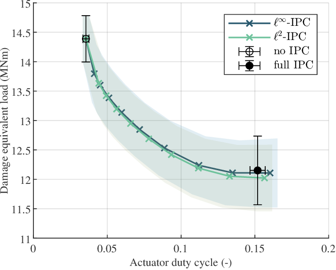

# Output-constrained invididual pitch control

Output-constrained individual pitch control can find a trade-off between no IPC
and full IPC by adding the possibility to set a reference on the oscilating
loads experienced by the wind turbine rotor. For example, in the below figure
you can see that without IPC the actuator duty cycle (ADC) is low and the damage
equivalent load (DEL) is high. On the other hand, fully engaging IPC can lower
the DEL at the expense of increased ADC. The proposed ℓ2-IPC and ℓ∞-IPC controllers achieve a superior trade-off between DEL reduction
and ADC increase. With respect to full IPC, they can achieve 87% of the load
reduction with just 50% of the actuation increase.

For more information, check out our publications on output-constrained IPC:

1. Hummel, J. I. S., Kober, J., and Mulders, S. P.: Output-constrained
   individual pitch control methods using the multiblade coordinate
   transformation: Trading off actuation effort and blade fatigue load reduction
   for wind turbines, Wind Energy Science (accepted),
   <https://doi.org/10.5194/wes-2024-153>, 2025.
2. Hummel, J. I. S., Kober, J., and Mulders, S. P.: Output-Constrained
   Individual Pitch Control using an Adaptive Leaky Integrator for Wind Turbine
   Blade Load Reductions, American Control Conference (ACC), 2025.

In case you have any questions, please contact me. You can find my contact
details in the papers.

## Getting started

Clone the repo by `git clone --recurse-submodules
https://github.com/jesseishi/Output-constrained-IPC.git`. `--recurse-submodules`
is used to also clone the
[preplot-postplot](https://github.com/jesseishi/preplot-postplot) repository
which is used for plotting.

Then, you can get started in two ways:

1. Run your own simulations by defining a case in `generate_cases.py`, then run
   the case with `Run_cIPC.m` or multiple cases with `Run_batch_cIPC.m`, and
   then analyze with a script inspired by `Plot_xyz.m`.
2. Download our results and put them in the `Results/data` folder. You can now
   analyze all the results using `Plot_WES.m`.
    - Our ACC results are available upon request while our WES results can be
      found here:
      

## Folder structure

- `IEA-15-240-RWT`
  - Defines the IEA 15 MW reference turbine. Adjusted from
    [GitHub](https://github.com/IEAWindTask37/IEA-15-240-RWT), see
    `IEA-15-240-RWT/README.md` for the changes made.
- `preplot-postplot` (optional)
  - My plotting utilities to make nice plots with less boilerplate, available on
    [GitHub](https://github.com/jesseishi/preplot-postplot).
- `Results` (optional)
  - `data`: Stores simulation data to be used by plotting scripts. If you want
      to recreate our results, store our datasets in this folder. This folder
      has folders that mirror the folders of `InputFiles`. Then for each folder,
      there are folders indicating what reference signal was used by the
      controllers (e.g. `ref0` for a 0 Nm reference), then finally for each
      simulation there is an `.outb` file with OpenFAST outputs and a `.csv`
      files which also contrains logged signals from Simulink.
  - `figures`: Stores resulting figures.
  - `InputFiles`: Stores input files used by OpenFAST to run the different
    cases.
- `src`:
  - `Helper`: Contains helper functions.
  - `Lib`: Library with some static data (linearizations and optimal azimuth
    offsets).
  - `Models`: Constains the different Simulink models.
  - `TempCache` (optimal): Temporary cache folder.
  - `generate_cases.py`: Generate input files to run different cases (wind
speed, turbulence intensity, etc...).
  - `Plot_XYZ.m`: Scripts to plot the results.
  - `Run_batch_cIPC.m`: Script to run many OpenFAST simulations with an
    output-constrained IPC controller.
  - `Run_cIPC.m`: Script to run a single OpenFAST simulation with an
    ouput-constrained IPC controller.
  - `TurbSim_x64.exe`: TurbSim executable to generate turbulent wind files when
    running `generate_cases.py`.

## Software used

- Python 3.12.1
- Matlab and Simulink R2024b
- The [OpenFAST toolbox](https://github.com/OpenFAST/python-toolbox)
- [OpenFAST 3.5.0](https://github.com/OpenFAST/openfast/releases/tag/v3.5.0)
- TurbSim v2.0
- The [preplot-postplot](https://github.com/jesseishi/preplot-postplot) toolbox
  for plotting

## Licence

Apache-2.0 license, see `LICENSE`.
